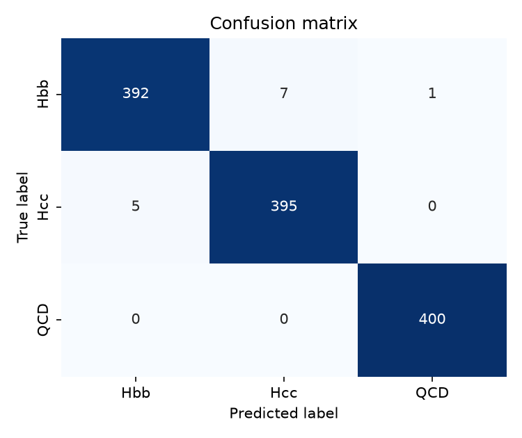
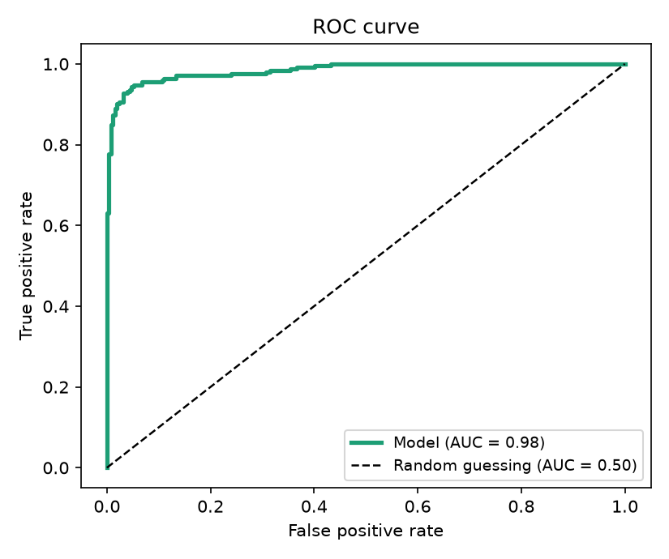

:::::: questions
- What physical process are we trying to classify when we look at a pair of jets from the CMS detector?
- Why is telling Hbb and Hcc jets apart harder than telling either of them apart from QCD background?
- Why does this problem call for machine learning instead of a hand-written rule?
- What does "mini" mean in MiniParT, and how does it relate to the full-scale Particle Transformer used in real CMS analyses?
::::::

:::::: objectives
- Describe the physics goal of this lesson: classifying jet pairs as Hbb, Hcc, or QCD background.
- Explain why bottom-quark and charm-quark jets are hard to tell apart.
- Describe what "training" a model means, and why simulated data is needed to do it.
- Explain why a transformer architecture is used here, and what "mini" simplifies compared to the full-size version.
::::::

## The question we're trying to answer

Deep inside the CMS detector at CERN, protons collide at nearly the speed
of light. (For background on the detector itself - its layers, subsystems,
and how it records a collision - see the CMS Open Data Workshop's
[detector lesson](https://cms-opendata-workshop.github.io/workshop2024-lesson-cms-detector/instructor/index.html);
this lesson picks up from there.) Occasionally, a collision briefly creates a **Higgs boson** - a
heavy, short-lived particle that almost instantly decays into other
particles. We care about three outcomes:

- The Higgs decays into **two bottom quarks** ("**Hbb**").
- The Higgs decays into **two charm quarks** ("**Hcc**").
- Nothing to do with a Higgs boson at all - just ordinary background,
  called "**QCD**."

Quarks can't fly around on their own: as they shoot away from the
collision, they drag along a spray of other particles, called a **jet**.
So what we actually see in the detector is jets, not quarks.

**Our job: look at a pair of jets and guess whether they came from Hbb,
Hcc, or QCD.**

This is hard because bottom and charm quarks are cousins - both "heavy"
quarks that behave similarly when they turn into jets. Telling their jets
apart is a genuinely open problem in particle physics; telling either of
them apart from ordinary QCD jets is easier. Keep those as two separate
questions as you go through this lesson ("is this a Higgs event at all?"
vs. "Hbb or Hcc?") - you'll see the distinction again in the confusion
matrix in the evaluation episode.

## Why use AI for this at all?

A human physicist can't look at raw detector data and just "see" whether
a jet came from a bottom quark, a charm quark, or nothing special. But
each jet leaves subtle clues - how its energy splits between charged and
neutral particles, how spread out it is, how many particles it contains.
No single clue is a smoking gun, but combined, they carry real
information. That's exactly the kind of problem machine learning is good
at: finding a pattern across many weak, noisy clues that no simple rule
can capture.

## What is "machine learning," in one paragraph?

Instead of a person writing rules like "if energy fraction > 0.6 then
it's probably a bottom quark," we show a computer program **thousands of
examples where we already know the right answer** (because the data is
simulated - see [Finding the Truth Labels](04-finding-the-truth-labels.md)),
and let it gradually adjust itself until it gets good at guessing
correctly. That process is "training," and the program doing the
adjusting is the "model."

## Why a *transformer*, and why "mini"?

A **transformer** is a model that's very good at looking at a *set* of
things and figuring out how they relate to each other - famously used for
understanding sentences, and also used in real CMS analyses to look at a
set of jets. We only have **two jets** per event here, so this is a
toy-sized version of the same idea used in professional particle physics
AI - hence **MiniParT** ("mini Particle Transformer").

It's "mini" because:
- It only looks at 2 jets at a time (real versions can handle 100+ particles per jet)
- It only uses 10 simple numbers per jet (real versions use many more)
- It's small enough to train on a laptop in minutes, not hours

MiniParT trades away detail (raw particle-level information, larger
networks, more jets per event) in exchange for being small enough to
fully understand and train quickly. Real CMS analyses use the full-size
Particle Transformer specifically because that extra detail helps with
the hard Hbb-vs-Hcc problem - nothing about "mini" changes the physics
goal, only how much information the model has to work with.

## Roadmap

This lesson runs entirely in Google Colab, so the next episode covers
setting up a Colab notebook and streaming CMS data directly from CERN.
After that, the lesson builds MiniParT from scratch, step by step:

1. [**Working in Google Colab**](02-colab-and-data-access.md) - setting up Colab and streaming CMS Open Data directly, without downloading anything
2. [**What Is a Jet?**](03-what-is-a-jet.md) - the raw ingredients: 10 numbers per jet
3. [**Finding the Truth Labels**](04-finding-the-truth-labels.md) - how we know the "right answer" for training
4. [**Preparing the Data**](05-preparing-the-data.md) - getting the numbers ready for a neural network
5. [**Building MiniParT**](06-building-mini-part.md) - the model itself, piece by piece
6. [**Training the Model**](07-training-the-model.md) - how it actually learns
7. [**Evaluating the Model**](08-evaluating-the-model.md) - did it work, and how do we know?
8. [**The Complete Code**](09-complete-code.md) - every piece, assembled in one place

Each of episodes 2 through 8 follows the same shape: **it opens with the
complete code for that episode, ready to run in one go**, followed by a
line inviting you to read on. Copy that opening block into a new cell,
run it, and *then* read the prose that follows - that's where the actual
teaching happens, walking back through the code you just ran one small
idea at a time: why a feature is included, what a line of PyTorch is
really doing, why a step needs to happen before another one. Where a
code block produces visible output (a print statement, a shape, a plot),
a block right underneath it shows what you should see.

These opening code blocks are cumulative: each one assumes every earlier
episode's opening block is already sitting in your Colab notebook, run in
order. By the end of episode 7 your notebook *is* a trained MiniParT
model, built up one episode at a time. Episode 9 then reprints the whole
pipeline as a single reference, for whenever you want to see it all
without the surrounding explanation.

## How we'll judge whether it worked

Later in this lesson, in [Evaluating the Model](08-evaluating-the-model.md),
we check whether MiniParT actually learned something useful, using three
tools covered there in full: a confusion matrix, ROC curves with AUC, and
comparing the model's internal representations with cosine similarity.
Here's a short preview of the first two, using illustrative data, so
you recognize them when you meet them for real.

**Confusion matrix**, in brief: a grid where rows are the true class and
columns are the model's guess, so a perfect model has large numbers only
on the diagonal.

This example shows good overall performance - most events land on the
diagonal - but look closely and there's visible confusion between two of
the three classes (a handful of events leak each way between them),
while the third class is separated from both almost perfectly. That
exact pattern, two classes that are hard to tell apart plus a third that
isn't, is the situation this lesson's Hbb/Hcc/QCD problem is actually in.

Generated with the same sklearn/seaborn/matplotlib code shown later in
this lesson, using illustrative data - not this lesson's actual results.

**ROC curve and AUC**, in brief: a curve tracing the tradeoff between
catching more real signal and letting more background through, as the
model's confidence threshold slides from strict to loose; **AUC**
condenses that whole curve into one number from 0 to 1.

A curve that hugs the top-left corner, away from the diagonal, is what
strong separation looks like - catching signal while letting almost no
background through. AUC boils that shape down to a single number: close
to 1.0 means close to that corner, close to 0.5 means close to the
diagonal, no better than a coin flip. The AUC near 1 shown here is
illustrative, not this lesson's actual number.

Generated with the same sklearn/seaborn/matplotlib code shown later in
this lesson, using illustrative data - not this lesson's actual results.

**Dot product / cosine similarity**, in brief: the model represents every
event internally as a vector of 64 numbers, and cosine similarity
compares two such vectors by direction alone, ignoring length - close to
1 means pointing the same way, close to -1 means opposite, close to 0
means unrelated. [Evaluating the Model](08-evaluating-the-model.md) uses
this to sanity-check what the model learned internally, independent of
its final guess.

::::::::::::::::::::::::::::::::::::: challenge

## Question

Q: A friend says "the model just needs to learn to recognize a Higgs boson in the data." What is slightly wrong with that, and what is the model actually being asked to do?

:::::::::::::::: solution

A: The model never sees a Higgs boson directly - it decays before reaching the detector. The model sees two jets and has to guess, from 10 summary numbers per jet, whether that pair is more consistent with Hbb, Hcc, or QCD. "Recognizing a Higgs boson" really means recognizing patterns in the jets it leaves behind.

:::::::::::::::::::::::::
:::::::::::::::::::::::::::::::::::::::::::::::

:::::: keypoints
- We're teaching a computer to classify pairs of jets into Hbb / Hcc / QCD.
- We use simulated CMS data because it comes with a built-in answer key.
- MiniParT is a scaled-down version of a real particle physics AI architecture - small enough to fully understand, built the same way the real ones are.
::::::
