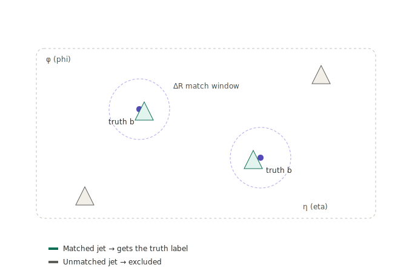

:::::: questions
- Why does training a model require already knowing the right answer for each example?
- How do we identify which simulated particles came from the Higgs boson, using only ID numbers?
- How do we match a truth-level quark to an actual reconstructed jet, and why is that not automatic?
- Why does the QCD background sample not need any of this matching?
- How does all of this become the label (0, 1, or 2) attached to each training example?
::::::

:::::: objectives
- Explain what supervised learning means and why simulated data provides a built-in answer key.
- Identify a particle's type and parent using `GenPart_pdgId` and `GenPart_genPartIdxMother`.
- Compute the angular distance ΔR between two directions and explain why `phi` needs special handling.
- Explain why matching jets to truth quarks is unnecessary for the QCD background sample.
- Describe how surviving events are turned into labeled training examples.
::::::

## Run this first

```python
def delta_phi(phi1, phi2):
    dphi = phi1 - phi2
    return (dphi + np.pi) % (2*np.pi) - np.pi

def extract_features(filepath, label, is_signal=True, max_events=None):
    tree = uproot.open(filepath)["Events"]
    
    # Load required branches
    branches = FEATURE_NAMES.copy()
    if is_signal:
        branches += [
            "GenPart_pdgId", "GenPart_pt", "GenPart_eta", 
            "GenPart_phi", "GenPart_mass", "GenPart_genPartIdxMother"
        ]
    
    events = tree.arrays(branches, entry_stop=max_events)
    
    if is_signal:
        # Determine target quark based on label (0: b-quark=5, 1: c-quark=4)
        target_pdg = 5 if label == 0 else 4
        
        mother_idx = events.GenPart_genPartIdxMother
        valid = mother_idx >= 0
        mother_pdg = ak.where(valid, events.GenPart_pdgId[mother_idx], -999)
        
        is_higgs_dau = (abs(events.GenPart_pdgId) == target_pdg) & (mother_pdg == 25)
        mask = ak.num(events.GenPart_pt[is_higgs_dau]) == 2
        events = events[mask]
        is_higgs_dau = is_higgs_dau[mask]
        
        # Build 4-vectors
        jets = ak.zip({
            "pt": events.Jet_pt, "eta": events.Jet_eta,
            "phi": events.Jet_phi, "mass": events.Jet_mass
        }, with_name="Momentum4D")
        
        dau = ak.zip({
            "pt": events.GenPart_pt[is_higgs_dau], "eta": events.GenPart_eta[is_higgs_dau],
            "phi": events.GenPart_phi[is_higgs_dau], "mass": events.GenPart_mass[is_higgs_dau]
        }, with_name="Momentum4D")
        
        d1, d2 = dau[:, 0], dau[:, 1]
        
        # Match using dR < 0.4
        dr1 = np.sqrt((jets.eta - d1.eta[:, None])**2 + delta_phi(jets.phi, d1.phi[:, None])**2)
        dr2 = np.sqrt((jets.eta - d2.eta[:, None])**2 + delta_phi(jets.phi, d2.phi[:, None])**2)
        matched = (dr1 < 0.4) | (dr2 < 0.4)
        
        # Extract features for matched jets
        matched_events = events[matched]
        
        # Keep exactly 2 matched jets
        mask_2jets = ak.num(matched_events.Jet_pt) == 2
        final_events = matched_events[mask_2jets]
        
    else:
        # For QCD, require at least 2 jets and take the top 2 leading jets
        mask_2jets = ak.num(events.Jet_pt) >= 2
        events = events[mask_2jets]
        # Slice to keep only the first 2 jets
        final_events = events[:, :2]

    # Stack features into a NumPy array of shape (N_events, 2_jets, N_features)
    feature_list = []
    for feat in FEATURE_NAMES:
        # Fill missing values with 0 (e.g., puId might have NaNs depending on pt)
        arr = ak.fill_none(final_events[feat], 0)
        feature_list.append(ak.to_numpy(arr))
        
    X = np.stack(feature_list, axis=-1)
    y = np.full(X.shape[0], label)
    
    print(f"Loaded label {label}: {X.shape[0]} events")
    return X, y
```

---
*Run the block above first, then read on to see what each part does.*

This defines `extract_features()`, which this episode builds piece by
piece below - a single function that takes a file path, a label, and
whether the sample is signal or background, and returns the finished
`(X, y)` arrays. It isn't called yet - that happens once per file in
[Preparing the Data](05-preparing-the-data.md).

## Why we need an answer key

To train a model with examples, we need to already know the right answer
for each one - otherwise there's nothing to learn from. This is called
**supervised learning**: a known answer supervises (corrects) the model
while it learns.

For real collision data, nobody can look at the debris and just *know*
which quark caused which jet. But for **simulated** data, the simulation
generated the whole event starting from "create a Higgs boson that decays
to two bottom quarks," so it also secretly records what actually
happened at the truth level, before detector effects blur things. That
record is stored in extra columns starting with `GenPart_*`
("Generator-level Particle"). We only use these truth columns to *build
our training labels* - the model itself never sees them.

## The two signal files (ttHTobb, ttHTocc): matching jets to truth

In plain words, before any code: jets are matched to generator-level
truth quarks by angular distance (ΔR), and only jets that survive that
match get used to build a training label - anything that doesn't match
close enough to a truth quark is thrown away.



For the signal samples, we need to figure out: *of all the jets in this
event, which ones actually came from the Higgs boson's b-quarks (or
c-quarks)?* This is a two-step process, handled inside the
`extract_features()` function you already ran above.

### Step 1 - Find the Higgs boson's daughter quarks

Every particle in `GenPart_*` has:
- `GenPart_pdgId` - an ID number identifying *what* the particle is,
  using the standard **PDG ID** scheme: `5` = bottom quark, `4` = charm
  quark (`-5`/`-4` are their antimatter partners, hence `abs(pdgId)`),
  `25` = Higgs boson.
- `GenPart_genPartIdxMother` - which earlier particle in the list is this
  particle's "parent."

So "find the Higgs boson's daughter quarks" becomes: *find particles
whose ID is ±5 (or ±4) and whose parent's ID is 25.*

```python
target_pdg = 5 if label == 0 else 4          # 5 = bottom quark, 4 = charm quark
mother_pdg = ak.where(valid, events.GenPart_pdgId[mother_idx], -999)
is_higgs_dau = (abs(events.GenPart_pdgId) == target_pdg) & (mother_pdg == 25)
```

A Higgs decaying to two quarks should have exactly two of these, so we
throw away any event where that isn't true:

```python
mask = ak.num(events.GenPart_pt[is_higgs_dau]) == 2
```

`ak.num(...)` counts how many entries survive the filter per event (since
every event can have a different number of `GenPart_*` entries); `mask`
then keeps only events with exactly two daughter quarks.

### Step 2 - Match those quarks to actual reconstructed jets

Knowing which truth-level quarks came from the Higgs isn't quite enough -
we need to know which *reconstructed jets* correspond to them. We do that
with a geometric trick.

`eta` and `phi` are like latitude and longitude for a particle's
direction. We measure the "distance" between a jet and a truth quark
using **ΔR** ("delta R"):

```
ΔR = sqrt( (Δeta)² + (Δphi)² )
```

A small ΔR means the jet and quark point in almost the same direction -
good evidence the jet *is* the spray created by that quark. We use a
threshold of **ΔR < 0.4**, matching the cone size CMS's jet-clustering
algorithm actually used to build the jet in the first place:

```python
dr1 = np.sqrt((jets.eta - d1.eta[:, None])**2 + delta_phi(jets.phi, d1.phi[:, None])**2)
matched = (dr1 < 0.4) | (dr2 < 0.4)
```

`matched` is `True` for any jet within ΔR of 0.4 of either Higgs daughter
quark - this is what turns "here is a truth-level quark" into "here is
the jet it produced."

### Why `delta_phi` needs its own function

`phi` wraps around a circle (0 to 2π, then back to 0), like a clock face.
If one jet is at `phi = 0.1` and another at `phi = 6.2` (near 2π), a naive
subtraction says they're almost 3.5 radians apart, when really they're
neighbors either side of the wraparound point. `delta_phi` fixes that by
squeezing the difference back into `[-π, π]`, so it always reports the
*shortest* way around the circle:

```python
def delta_phi(phi1, phi2):
    dphi = phi1 - phi2
    return (dphi + np.pi) % (2*np.pi) - np.pi
```

### Keeping exactly two matched jets

Finally, we only keep events with exactly two matched jets - one per
Higgs daughter quark - since MiniParT always looks at a pair:

```python
mask_2jets = ak.num(matched_events.Jet_pt) == 2
final_events = matched_events[mask_2jets]
```

`final_events` now holds only clean signal events: exactly two jets, both
confirmed matches to the Higgs boson's daughter quarks.

## The background file (QCD): no matching needed

For the QCD background sample, there's no Higgs boson to match to. So we
take the simpler approach of grabbing the two highest-momentum ("leading")
jets in each event:

```python
mask_2jets = ak.num(events.Jet_pt) >= 2
events = events[mask_2jets]
final_events = events[:, :2]     # keep the first 2 jets
```

## Turning this into labels

Every surviving event becomes one training example: 2 jets × 10 features,
with one label attached:

- `label = 0` → the jet pair is from **Hbb**
- `label = 1` → the jet pair is from **Hcc**
- `label = 2` → the jet pair is **QCD** background

```python
X = np.stack(feature_list, axis=-1)   # shape: (n_events, 2, 10)
y = np.full(X.shape[0], label)
```

## Quick recap
- Truth-level (`GenPart_*`) columns exist only in simulation, and only get used to *build labels* - never fed to the model.
- We find the Higgs boson's daughter quarks by PDG ID (5 = bottom, 4 = charm) and mother ID (25 = Higgs).
- We match those truth quarks to real jets using ΔR - a "distance on the sky" built from `eta` and `phi`.
- QCD background just uses the two leading jets, since there's no Higgs decay to match to.
- Next: [Preparing the Data](05-preparing-the-data.md) - preparing this data to actually feed into a neural network.

::::::::::::::::::::::::::::::::::::: challenge

## Question

Q: Suppose you changed the matching threshold from `dr1 < 0.4` to a much stricter `dr1 < 0.1` (and the same for `dr2`). Would you expect `final_events` to end up with more, fewer, or about the same number of events, and why?

:::::::::::::::: solution

A: Fewer events. A stricter (smaller) ΔR threshold means a jet has to point much closer to a truth quark's direction to count as "matched." Some jets that would have matched at ΔR < 0.4 will now fail the ΔR < 0.1 cut, so fewer events will end up with exactly two matched jets. This is a real tradeoff: a tighter threshold gives more confidence a match is correct, at the cost of throwing away usable events.

:::::::::::::::::::::::::
:::::::::::::::::::::::::::::::::::::::::::::::

:::::: keypoints
- Truth-level (`GenPart_*`) columns exist only in simulation, and only get used to build labels, never fed to the model.
- We find the Higgs boson's daughter quarks by PDG ID (5 = bottom, 4 = charm) and mother ID (25 = Higgs).
- We match those truth quarks to real jets using ΔR, a "distance on the sky" built from `eta` and `phi`, using a 0.4 threshold that matches the jet clustering cone size.
- QCD background just uses the two leading jets, since there's no Higgs decay to match to.
::::::
